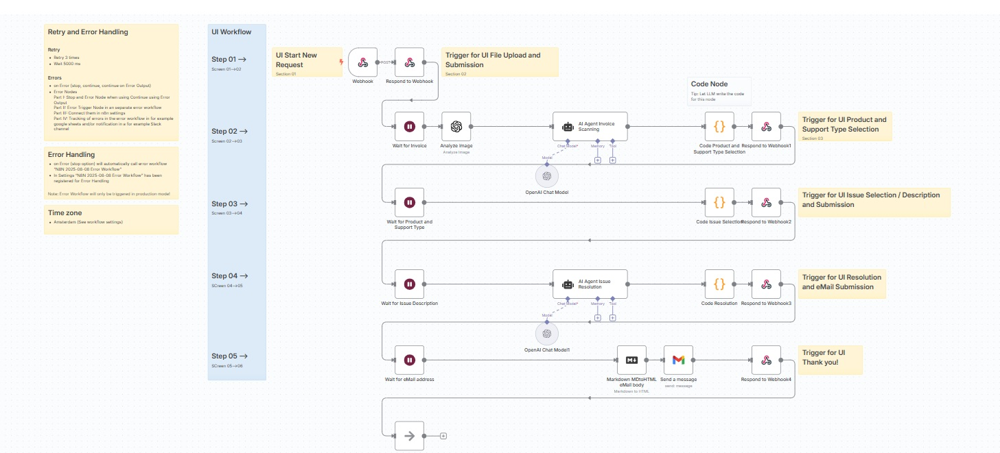
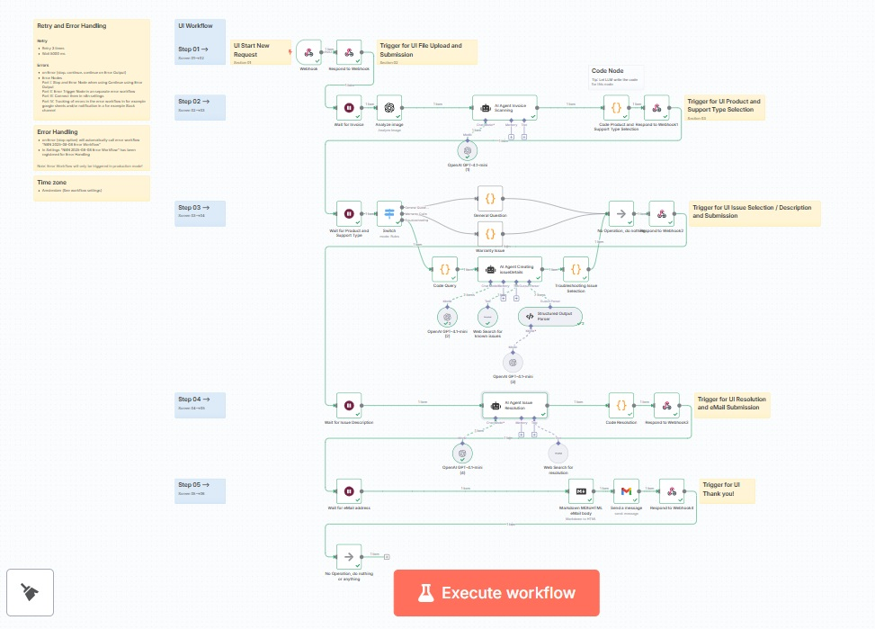
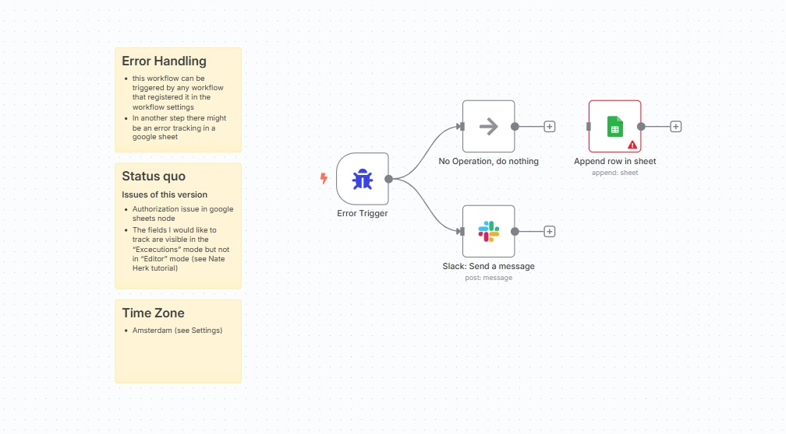

# Customer Claims Portal

## Requirements:

- Node.js ≥ 18
- npm

## High level overview

**Workflow alignment**
- The project demonstrates how to align a UI and a N8N workflow using webhooks, wait and respond-to-webhook nodes and the resumeUrl in order to create interaction cycles handing over control from an UI status workflow to N8N wait and respond-to webhook loops and vice versa.

**Components**
- index.html represents the UI
- index.js acts as a proxy-middleware webserver
- N8N acts as the backend

 
**Wait Nodes**
- wait nodes are similar to form nodes and human-in-the-loop nodes in n8n but they give more flexibility to design user interfaces in line with the ui-policies and ui-themes of a company

- form-submission node 
- human-in-the-loop nodes

- wait node

They are based on

- webhooks which are api-calls and act like a http-request as a basic api-call

**Pattern**
1. Initialization
Initialization by frontend creating a post request to the webhook address specified in the n8n webhook node.
Frontend waits for the response to the post request (asynchronously).
The n8n webhook node (as a special wait node) gets triggered by the post request of the frontend.
The first thing it does is to generate a unique process specific $execution.resumeUrl (in any case even when there is no wait node) that will act as a handle for the frontend to connect to this specific instance of the workflow and then starts the workflow. 
The following respond-to-webhook node sends the generated resumeUrl back to the frontend (maybe even with some specific first payload)(in this case it only sends back the resumeUrl).
The response of n8n is the response that the frontend was waiting for as the response to its post request.
The frontend now switches to the next page (in this case the page for the file upload).
After processing the respond-to-webhook node the n8n workflow runs into a wait node. This is the starting point of the first cycle.

2. Loop:
The frontend has a resumeUrl. It processes what needs to be processed (file upload, product and support type selection, issue description and eMail address collection after displaying the resolution) and sends a post request to the resumeUrl of n8n containing some payload that needs to be processed by n8n (file, product and support type, issue description and eMail address) and asynchronously waits for the n8n response.
The wait-Node gets triggered by the frontend sending the resumeUrl of the last respond-to-webhook node, receives the input data from the frontend and generates the resumeUrl for the next wait node (or is it generated once and will be consumed by the next active wait node)
N8N workflow nodes process input data and create the payload for the next respond-to-webhook node (product and support types, issue selection or request for issue description, resolution and confirmation for eMail)
respond-to-webhook Node sends back the payload for the UI and the resumeUrl to trigger the next wait node

3. Step out
after last respond-to-webhook node (confirmation everything went well or not) do something or nothing 

Summary:
workflow gets awakened in webhook / wait nodes by receiving post request of frontend
response-to-webhook node sends the response to the waiting post request of the frontend which in turn lets the frontend move on
and n8n workflow runs in another wait node to start the next cyle waiting for the next post request of the frontend









**Advantage of this workflow concept**
Because we have a single workflow we can access any data of any step even we would wait for months at some wait node for the workflow to be resumed.

## Tutorial and Documentation

This project follows the youtube tutorials of Bart Slodyczka

[https://www.youtube.com/watch?v=9Po584wKXAM](https://www.youtube.com/watch?v=9Po584wKXAM)
[https://www.youtube.com/watch?v=3hvNCeWDdKQ](https://www.youtube.com/watch?v=3hvNCeWDdKQ)

## Special attention

This error:

```
TypeError: Response body object should not be disturbed or locked
    at node:internal/deps/undici/undici:13510:13
```
means that the Express req stream is being read twice for the same request.

1. Double-check for global body parsers
Make sure you have no app.use(express.json()) or app.use(express.urlencoded()) anywhere in your code, even commented out or in other files.
2. Check for route-specific body parsers
Only /api/start-workflow should use express.json().
/api/resume-workflow should not use any body parser.

## .env
```
N8N_WEBHOOK_URL=your-initial-n8n-webhook-here (change this URL once N8N gets out of test mode and in production)
```

## git and github:
```
git init
git remote add origin https://github.com/yourusername/customer-claims-portal.git
git add .
git commit -m "Initial commit: Customer Claims Portal"
git branch -M main
git push -u origin main
```

## Run frontend locally
```
cd customer-claims-portal
npm install
npm run dev
```

Access frontend via [http://localhost:5000/](http://localhost:5000/)

## Run N8N workflow (test and production)

Be aware that in test mode you have to execute workflow manually for each test cycle
```
[N8N 2025-07-29 Customer Claims Portal](https://jn2atbn3.rpcld.cc/workflow/I4F2Ny5WAIfd85YW)
```
## Deployment
**Deployment**

**Run frontend in production**
```
Set N8N_WEBHOOK_URL using the Production webhook URL of the "N8N 2025-07-29 Customer Claims Portal" workflow

More instructions coming

```
**Run N8N in production**
```
Activate "N8N 2025-07-29 Customer Claims Portal"

```

## Next Steps

- use AI agent to create a product specific issue list for issue selection (MacBook, USB-Adapter ...) with references and default template

- Provide tool(s) (web search or RAG) for the issue resolution (code node for query?)

- what happens if user simply closes the browser (wait node timer?) what is best practice here

- getting ready for production (error handling, ...) 

## What is "Production Ready"

- consistency of output
- scaling
- security
- error handling
- environment specification (runtime environment, libraries ...) (pyenv, .venv, requirements.txt, package.json, ...)
- version control

## Error Handling

**Overview**

- error Workflow, logging and notifications
- fail safely
- fallback llm (Note: new setting in a new version of n8n or building it manually using the continue on error option)
- continue on error
- polling (wait loop)

- building guardrails
"You do not know what you do not know so identifying patterns in the log files help you to define guard rails"

**Tutorials**

- [Bart tutorial about retry and error handling](https://www.youtube.com/watch?v=ASnwt2ilg28)

- N8N documentation

[N8N documentation: error handling and how to test it](https://docs.n8n.io/flow-logic/error-handling/#error-data)

[N8N documentation](https://docs.n8n.io/courses/level-two/chapter-4/)

[Nate Herk tutorial about error handling](https://www.youtube.com/watch?v=bTF3tACqPRU)

[Nate Herk tutorial about error handling techniques](https://www.youtube.com/watch?v=Irk4-DO5qgM)

**Findings**

- Error Catching in Production Mode only!

- Register an error logging workflow in the workflow settings.

- "stop and error node" in case of "continue on error output" option is a good solution in case 
you have to process several items and do not want to stop the workflow because one item causes an error (for example there is an item in double quotes ""item"" instead of "item").

- In general if in the node settings you choose the default "stop workflow" option an error is thrown that will be caught by the error workflow that is specified in the workflow's settings.

- I found that if the workflow stops the response to the post requests is cancelled automatically and produces an error in the frontend (caught in index.js and the workflow stops)


